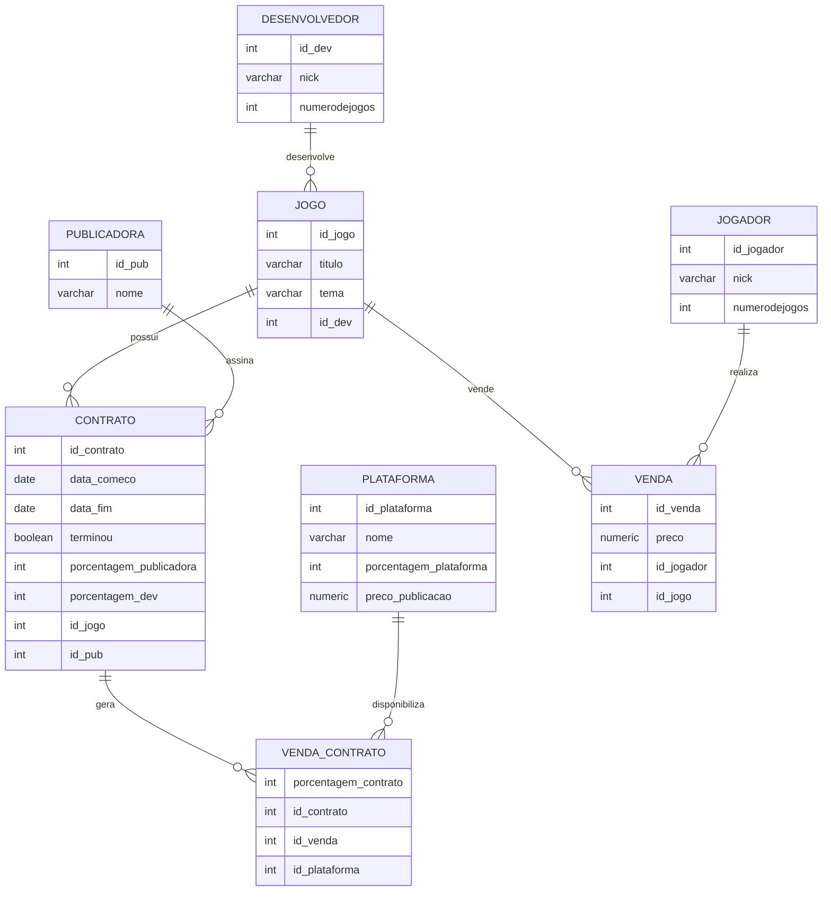

# Proj 2 Banco de Dados Steam Proj

## Integrantes do Grupo

* Matheus Ferreira de Freitas
  RA: 22.125.085.5
* Henrique Hodel Babler
  RA: 22.125.084.8

---

## Ordem de Execução

1. **CriarTabelas.py**
   Cria todas as tabelas do banco necessárias para o projeto.
   1.1. Se ocorrer algum erro nas tabelas, use **ApagarTudo.py** para reiniciar a estrutura do banco.
2. **PreencherBanco.py**
   Insere dados de exemplo em todas as tabelas para testes.
   2.1. Se precisar limpar apenas os dados sem alterar a estrutura, use **LimparBanco.py**.
3. **ValidarDados.py**
   Executa verificações básicas de contagem e integridade dos registros.

---

## Queries Interessantes

No arquivo `QuerriesInteressantes.txt` você encontra explicações detalhadas para cada query utilizada.

---

## Modelo Conceitual (Mermaid)

